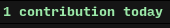
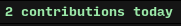
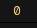

# AwesomeWM Github Today Widget

Shows you how many contributions you've made today.

This widget is inspired by the [github-contributions-widget by streetturtle](https://github.com/streetturtle/awesome-wm-widgets/tree/master/github-contributions-widget). I think this widget is great, but there were a few things that I was not satisfied with:

1. The widget relies on the https://github-contributions.now.sh/ API, which means if this website is ever taken down, the widget will be useless.
2. I wanted to specifically view how many contributions I've made today to remind me to commit and push personal projects, which I often forget.
3. The widget uses easy_async instead of watch, which means the widget never updates unless you reload awesomewm. This widget uses watch and refreshes the contributions every 10 minutes by default (and can be changed using the `interval` argument).

Instead of using an external API, this widget relies on a small application written in Go that will make an HTTP to Github to retrieve the number of contributions for today. This application and its source code can be found in the `api` directory.

## Customization

The widget takes the following arguments:

| Name | Default | Description |
|---|---|---|
| `username` | `<empty string>` | (Required) GitHub username. |
| `widget_path` | `widgets` | The directory that your widget folder is installed in, relative to your config path. The default value of "widgets" means your plugin folder is located at ~/.config/awesome/widgets. |
| `interval` | `600` | How many seconds to wait before checking for new contributions. The default is 600 seconds (10 minutes). |
| `left` | `0` | Amount of left padding in the widget's margin container. |
| `right` | `0` | Amount of right padding in the widget's margin container. |
| `top` | `0` | Amount of top padding in the widget's margin container. |
| `bottom` | `0` | Amount of bottom padding in the widget's margin container. |
| `no_contrib_text` | `No contributions today` | The text to display when there are no contributions today. |
| `no_contrib_markup` | `<span foreground="#ff3c3c"><b>%s</b></span>` | The markup string to show if there have been no contributions today. %s will be replaced with the text from the contrib_text argument. |
| `contrib_text` | `%s %s today` | The text to display when there are contributions today. The first %s will be replaced with the number of contributions, and the second %s will be replaced with the singular / plural version of the word "contributions". It is ok to only use one %s instead of two if you only need the number of contributions displayed (ex: contrib_text = "contributions: %s"). |
| `contrib_markup` | `<span foreground="#9be9a8"><b>%s</b></span>` | The markup string to show if there have been contributions today. %s will be replaced with the text from the contrib_text argument. |

### Screenshots

Default settings, no contributions:


Default settings, one contribution:


Default settings, more than one contribution:


Example using all arguments (see Installation), no contributions:


Example using all arguments (see Installation), one contribution:


## Installation

Clone/download repo under **~/.config/awesome** and use widget in **rc.lua**:

```lua
-- The widget is installed in ~/.config/awesome/widgets/github-today
local github_today_widget = require("widgets.github-today-widget.github-today-widget")
...
s.mytasklist, -- Middle widget
	{ -- Right widgets
    	layout = wibox.layout.fixed.horizontal,
		...
        github_today_widget({
            username = '<your username>'
        }),
		...
```

An example using all of the arguments:

```lua
-- In this example, the widget is installed in ~.config/awesome/widgets/github
local github_today_widget = require("widgets.github.github-today-widget.github-today-widget")
...
s.mytasklist, -- Middle widget
	{ -- Right widgets
    	layout = wibox.layout.fixed.horizontal,
		...
        github_today_widget({
            username = '<your username>',
            widget_path = 'widgets/github', -- This folder's path is ~/.config/awesome/widgets/github/github-today'
            left = 10,
            right = 10,
            top = 2,
            bottom = 2,
            no_contrib_text = "0",
            no_contrib_markup = '<span foreground="#f0c674">%s</span>',
            contrib_text = "%s TODAY!", -- ignoring the second %s
            contrib_markup = '<span foreground="#8abeb7">%s</span>'
        }),
		...
```

